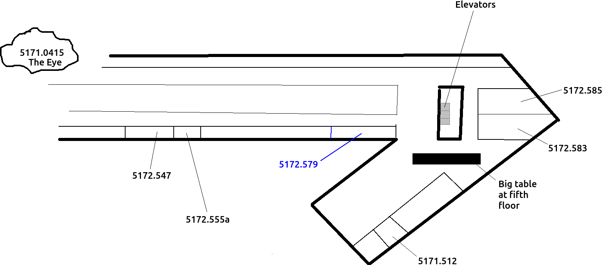
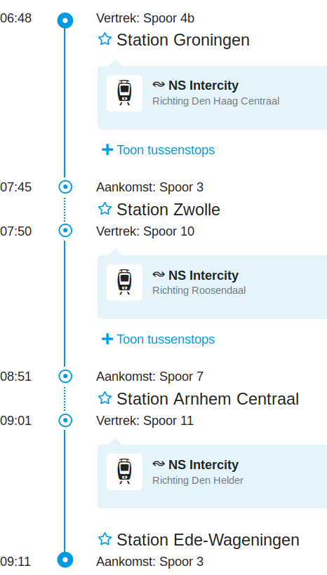
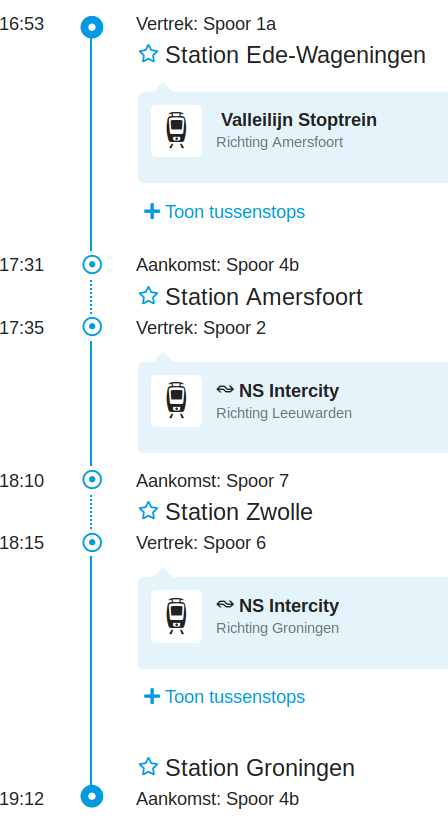

# internship_marijn

Internship of Marijn and Joshua at the Rijksuniversiteit Groningen.

## Monday April 15th 2019

Time|What|Where
---|---|---
8:30-9:00|Briefing Richel|Canteen of the Linnaeusborg at the Zernike campus
9:00-10:30|Meeting 1: Christoph Netz|Room 5172.583
10:30-12:00|Meeting 2: Theo Pannetier|Room 5172.547
12:00-13:00|Lunch|Big table at 5th floor
13:00-14:30|Meeting 3: Anne-Marie and Ines Daras|Room 5172.583
14:30-16:00|Meeting 4: Maaike Sangster|Room 5172.585
16:00-16:45|Colloquium Jorn Claassen: The (im)possibility of a universal species concept|Room 5171.0415 ('The Eye')
16:45-17:00|Evaluation with Richel, write report|Canteen

## Tuesday April 16th

NLSEB, 

 * We take the train at 6:48 at CS Groningen.
 * We'll leave at 16:30 at Ede-Wageningen and will be back at 19:12

:warning: bring a printed version of your NLSEB ticket, or have the mobile
version on your mobile phone

To|From
---|---
|

## Wednesday April 17th 2019

Time|What|Where
---|---|---
9:00-9:30|Briefing Richel|Canteen of the Linnaeusborg at the Zernike campus
9:30-11:00|Meeting 5: Pedro Neves|Room 5172.0547
11:00-12:30|Meeting 6: Self-organization group [1] |Room 5171.512
12:30-13:30|Lunch|Big table at 5th floor
13:30-16:00|TRES meetings|Room 5172.579 aka Blue Room
16:00-16:30|Evaluation with Richel, write report|Canteen

 * [1] On behalf of Marina Papadopoulou :smiley:

## Thursday April 18th 2019

Time|What|Where
---|---|---
8:30-9:00|Briefing Richel|Canteen of the Linnaeusborg at the Zernike campus
9:00-10:30|Meeting 7: Raphael Scherrer and Pratik Gupte|Room 5172.0547
10:30-11:00|Meeting 8: Cyrus Mallon|Room 5172.555a
11:00-12:00|Meeting 9: ? |Room ?
12:00-13:00|Lunch|Big table at 5th floor
13:00-16:00|Write report|Room ?
16:00-16:15|Free (Richel needs to grade the report)|.
16:15-16:45|Evaluation with Richel|Canteen

## Questions for supervisors

### Who is Marijn?

Marijn is a 16 year old scholar,
that followed Richel's Arduino course and worked
on building a 3D printer.

### What should I do during my slot

You can fill the time in any way you like.

Consider:

 * telling/showing your work
 * teaching some basic biology, to prepare him for NLSEB and the TRES meeting
 * show the lab/campus/etc
 * taking a walk

### A slot of 90 minutes is too long for one person

Slots can also be filled with more than one person :wink:

### Aaah! I cannot be there! What should I do?

It's fine. Just let Richel or Marijn or any colleague know. 
We'll find a solution :+1:

### What is the goal of the internship?

To learn how working at a university is like.

### What will the intern deliver?

At April 18th 16:00, he'll hand in a report to answer the question:

> How do biologists investigate nature?
