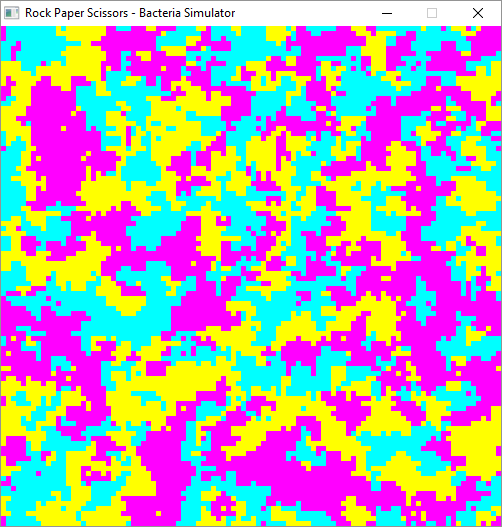
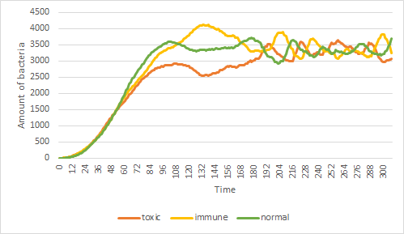

# Population dynamics of toxin-producing bacteria 

 * Authors: Marijn Meerveld and Joshua van Waardenberg

## Introduction

At the NLSEB conference we saw Hilje Doekes' presentation about toxin production in bacteria. 
In this presentation Hilje Doekes talked about toxic, immune and sensitive bacteria living together.
It is suprising that these bacteria can coexist because the number of food resources equals the number of species that can live together. 
Therefore one would expect that only one of the three sorts of bacteria survives.
But we know that these bacteria can live together [1].
We thought that this is a interesting topic so we wanted to replicate Hilje Doekes' setup.

## Hypothesis

we think that those tree bacteria can live together, because the bacteria create a rock-paper-scissors relationship,
where each bacteria can displace another bacteria in a circular order: 
toxic displaces sensitive, sensitive displaces immune, immune displaces toxic [1].

## Material and Methods

For this research we used a computer moddel [1]. In our computer model every bacterium lives in a cell on a torus shaped world.
All cells together form a grid, this grid is constantly beeing updated in a loop going from the upper left down to the lower right.
Each cycle all bacteria pick a random direction to where they are going to duplicate,
if the cell in that direction is empty the bacterium can always duplicate.
If there is an other bacterium in that cell it uses the rock-paper-scissors pattern described earlier to dertermine whether that cell can duplicate.
Once a bacterium has duplicated it locks the cell it has duplicated to to prevent the dupclicates of a bacterium from duplicating in the same cycle.

## Results

In this picture we see the simulation while running and you can see that the three different bacteria are living together.

This graph shows the ammount of bacteria of each sort. In the beginning the amount of bacteria grows rapidly, this is becouse we start with justs a single bacterium of every sort. After that stay sort of stable.

## Conclusion

With these results we can conclude that three competing bacteria can coexist.

## Discussion

To keep things simple we didn't implement everything like Hilje Doekes did.
We don't keep track of the toxicity rate of the cells and our bacteria don't die.

## References

 * [1] Kerr, Benjamin, et al. "Local dispersal promotes biodiversity in a real-life game of rock–paper–scissors." Nature 418.6894 (2002): 171.

## Acknowledgments

Thanks to Hilje Doekes' talk at NLSEB.
